 # ***Magic Duel By MTD - edition*** 

## **Introduction / thông tin sinh viên** 

+ Họ và tên: Mai Tiến Dũng - K68CB - UET

+ Mã sinh viên: 23020025 

+ Bài tập lớn: **Game Magic Duel - Đấu bài thế hệ mới** (INT2215_50 - Lập trình nâng cao)

# Table of content / phụ lục
- [Description / mô tả game](#description)
  * [Game description and instruction / mô tả game và cách xây dụng](#game-description-and-instruction)
  * [Control / điều khiển](#control)
  * [Preview / góc nhìn](#preview)
- [Objects In game / các đối tượng trong game](#objects-in-game)
  * [a. Các loại lá bài](#acác-loại-lá-bài)
  * [b. Cách chơi](#bcách-chơi)
- [Setup / cài đặt](#setup)
- [Play Game / chơi game](#play-game)
- [See also / nhìn chung](#see-also)
  * [Các kỹ thuật sử dụng](#các-kỹ-thuật-sử-dụng)
  * [Các nguồn tham khảo](#các-nguồn-tham-khảo)
- [Source Code Game / mã nguồn game](#source-code-game)
- [Conclusion / kết luận](#conclusion)
  * [Điều tâm đắc](#điều-tâm-đắc)
  * [Hạn chế](#hạn-chế)
  * [Hướng phát triển](#hướng-phát-triển)
- [A Special Thanks To / lời cảm ơn](#a-special-thanks-to)
- [Mức điểm tự đánh giá](#mức-điểm-tự-đánh-giá)

## **Description** 
### *Game description and instruction* 

- Video demo :
### *Control* 

- **Con trỏ chuột trái**: Chọn nút.
- **Con trỏ chuột phải**.
- **các nút bấm trong game**: ra/vào các chế độ trong game và thoát game.

### *Preview*
#### *Cửa sổ hiển thị Menu game gồm 5 lựa chọn: Duel mode- Chế độ chơi,Deck Construction- Xây dựng bộ bài,CardList- Danh sách lá bài, Option- Âm thanh, nhạc, Quit- Thoát game *

#### *Cửa sổ hiện thị hướng dẫn cơ bản các thuộc tính trong Game và cách chơi game*
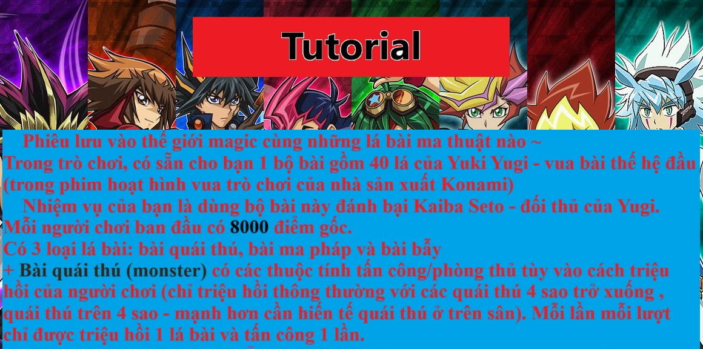

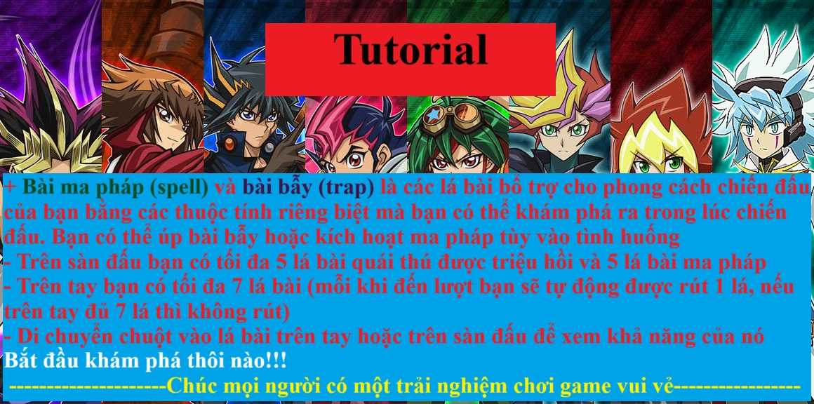

#### *Cửa sổ hiển thị âm lượng tùy chỉnh và bài hát*
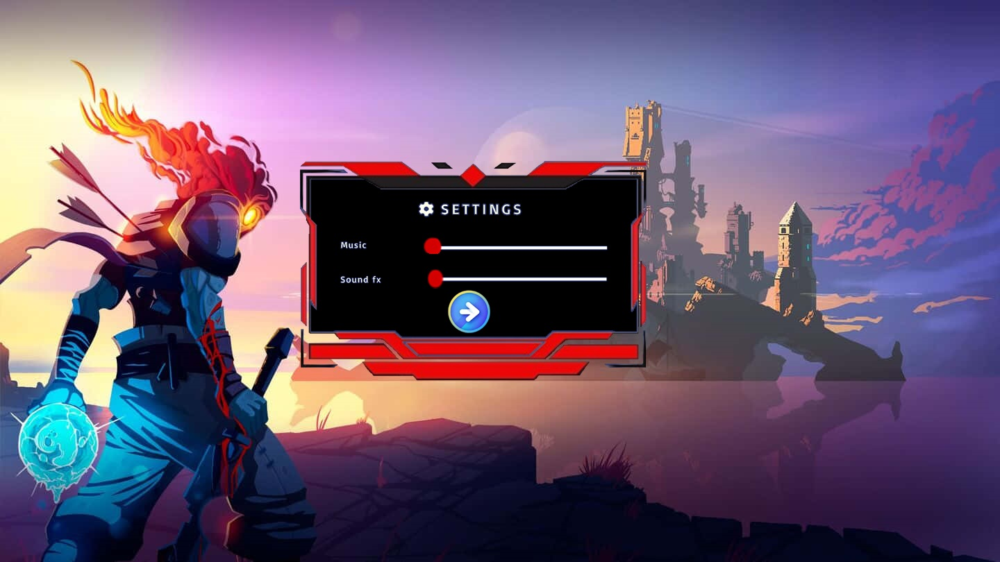

#### *Cửa sổ hiện thị màn hình sẵn sàng chơi Game, nhấn đúp chuột để vào trận*
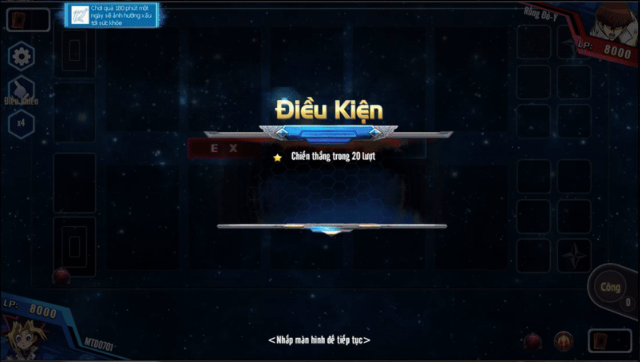

#### *Cửa sổ trò chơi*
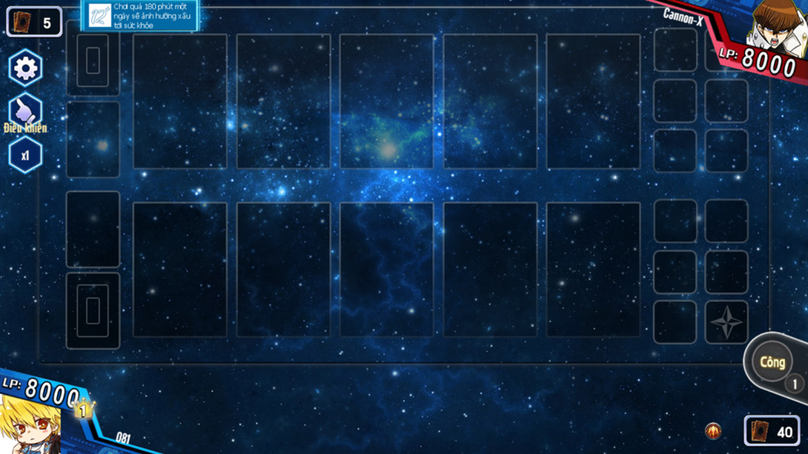

#### *Cửa sổ hiển thị thắng hay thua*
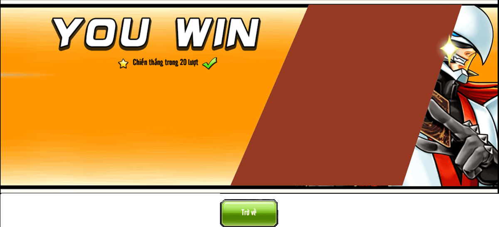

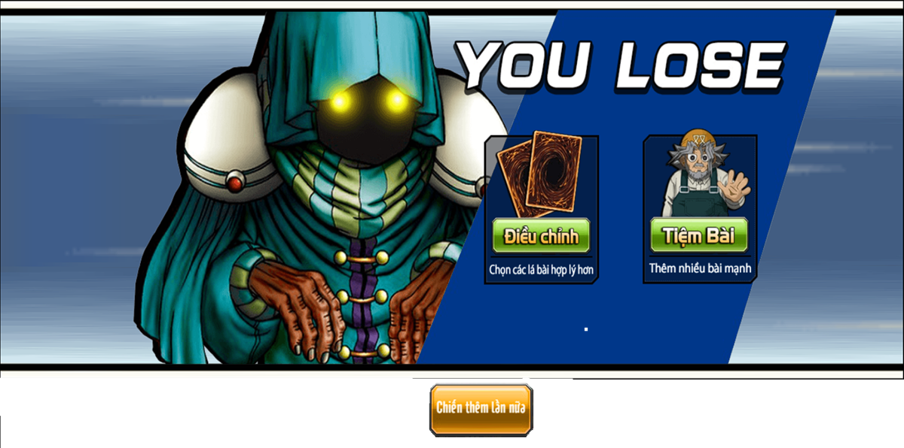

## **Objects In game**

## a. Các loại lá bài
Có 3 loại lá bài: bài quái thú(monster), bài ma pháp(spell) và bài bẫy(trap), bộ bài được xây dựng có 40 lá gồm 18 lá bài quái thú(trong đó có 8 quái thú khác nhau), 22 lá bài phép bẫy(trong đó có 17 lá phép bẫy khác nhau)
+ 8 lá quái thú sẽ mang lại chiến thắng cho bạn là: 

|                                         | Tên lá bài	       | Thông tin                                                                                        |
|-----------------------------------------|--------------------|--------------------------------------------------------------------------------------------------|
| 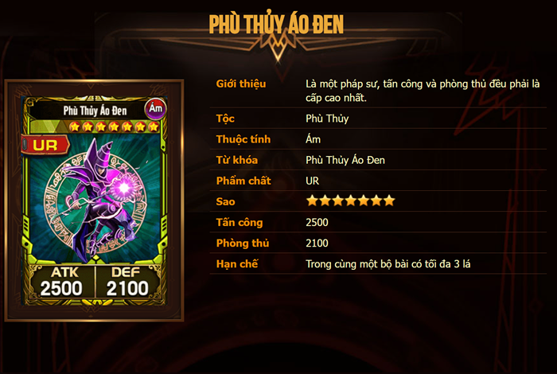 | Phù thủy bóng đêm  | ATK: 2500, DEF: 2100, 7 sao |
| 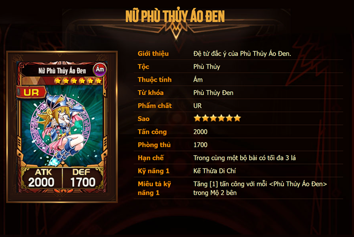 | Nữ phù thủy bóng đêm| ATK: 2000, DEF: 1700, 6 sao|
| 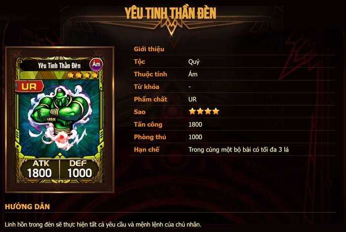   | Yêu tinh thần đèn	   | ATK: 1800, DEF: 1000, 4 sao|
| 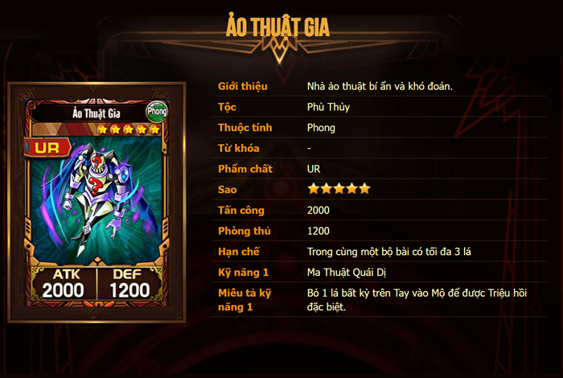 | Ảo thật gia	 | ATK: 2000, DEF: 1200, 5 sao|
| 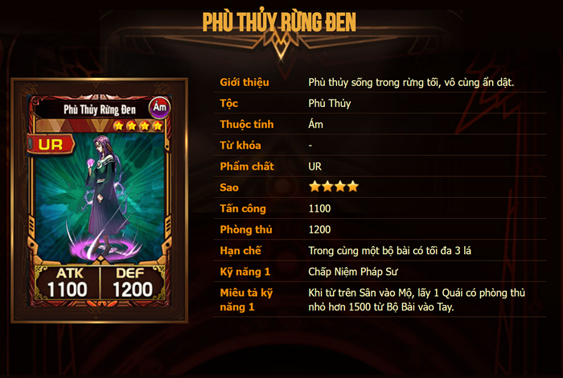   | Phù thủy rừng đen| ATK: 1100, DEF: 1200, 4 sao |
| 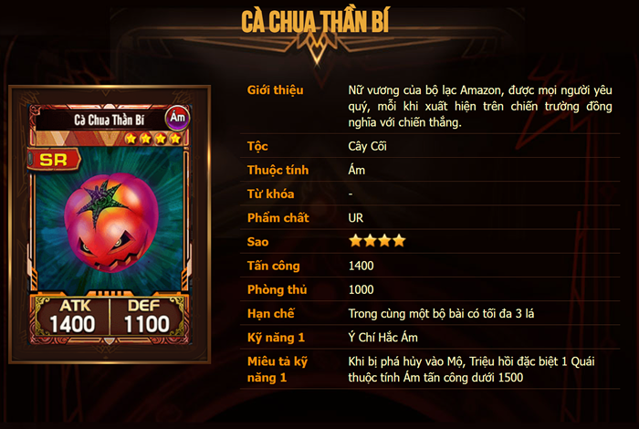   | Cà chua thần bí| ATK: 1400, DEF: 1000, 4 sao |
| 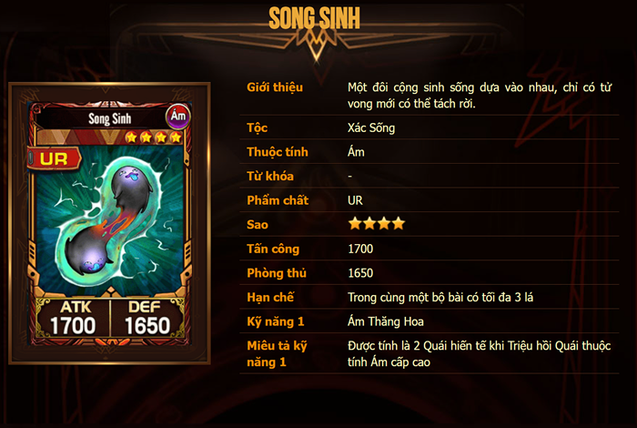   | Song sinh| ATK: 1700, DEF: 1650, 4 sao |
| 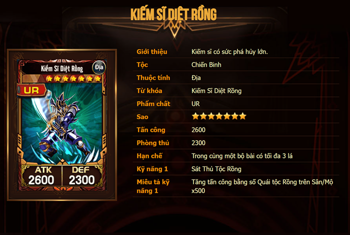   | Kiếm sĩ diệt rồng| ATK: 2600, DEF: 2300, 8 sao |

+ 17 lá bài ma pháp

## **Setup**
- Yêu cầu : có trình biên dịch C++ compiler(codeblock , vscode,visual studio,...).
    1. git clone về máy $ git clone https://github.com/top1server/TDcoDH
    2. trên trình biên dịch(em dùng visual studio, mở file ILoveYou.snl)
    3. Toàn bộ các file của project hiện ra, bấm build(F5) để chạy game
- *Mọi khó khăn trong phần cài đặt, trong quá trình chơi, vui lòng liên hệ qua 23020025@vnu.edu.vn.Em sẽ luôn nghe và phản hồi lại ý kiến góp ý của mọi người để phát triển tiếp project game này*

## **See also**  
### *Các kỹ thuật sử dụng*  

- Có sử dụng kiến thức toán học để tính toán và vẽ chuyển động của các cửa sổ, lá bài trong game.
- Các hàm trong các thư viện SDL 2.0 : SDL.h, SDL_image.h, SDL_ttf.h, SDL_mixer.h
- Các hàm và cấu trúc dữ liệu như mảng,string, pair, vector, struct, class,...
- Cách tách file, sử dụng vòng lặp, viết hàm để tối ưu số dòng code cũng như tối ưu code(em đã từng rút class game từ 4000 dòng xuống 600 dòng ^^) 
- Cách xây dựng các lớp đối tượng với từng class riêng để làm các mục đích khác nhau trong việc xây dựng game
- Xử lí các sự kiện ban phím, chuột, hình ảnh, chữ, thời gian, delay.
- Tạo menu và các nút bấm để chọn chế độ/âm thanh/hình ảnh/trạng thái mà mình muốn.
- Sử dụng Paint để tự xóa phông cho các hình ảnh có background phức tạp, còn các hình ảnh có background đơn giản thì sử dụng công cụ remove background trên trang web https://www.remove.bg/upload

### *Các nguồn tham khảo*

- Cách sử dụng thư viện SDL2.0, vận hành và quản lí chương trình, cách chia file:
    + Các buổi học lý thuyết của thầy **TS.Lê Đức Trọng**.
    + Các buổi học thực hành của thầy **CN. Trần Trường Thủy**.
    + Các bài học đọc và thực hành lại trên trang web **LazyFoo**.
    + kênh youtube cá nhân của các lập trình viên trong nước/nước ngoài
    + Nhóm facebook Phát triển phần mềm 123az
- Cách sử dụng, cài dặt SDL2.0 vào máy và tạo 1 project cho bản thân: các bạn trong phòng KTX G214 QGHN04: Vũ Xuân Dũng, Nguyễn Nho Dương, Lê Tuấn Cảnh, Lê Đức Hoàng Anh, Nguyễn Đức Anh, Nguyễn Hải An, Nguyễn Xuân Dũng
- Kênh Youtube: Phát triển phần mềm 123az, website: https://phattrienphanmem123az.com
- Hình ảnh: 
    + Lấy cảm hứng từ trò chơi trên trang Yugih5.com
    + Do game lấy cảm hứng từ bộ phim vua trò chơi - Yugio nên các hình ảnh (lá bài tải xuống từ trang web: [https://yugih5.com , chọn](https://yugih5.com/danh-sach-the-bai.1.html))
    + Các hình ảnh lấy từ google pinteres(ảnh gif , nếu đơn giản dùng web remove background và dùng paint cắt thành các spritesheet để làm thành các hiệu ứng click chuột, spell , vụ nổ: https://id.pinterest.com/pin/607845280976427835)
- âm thanh:
    + Các bài nhạc trong phim vua trò chơi Yugio lấy từ trang web https://www.nhaccuatui.com/playlist/yu-gi-oh-duel-monsters-theme-song-collection-va.aUMoplWD48x5.html , tiếng gió thổi, click chuột

## **Source Code Game**

- Folder images chứa tất cả các ảnh trong game, trong đó:
  + Folder Deckconstruction chứa các hình ảnh của menu Deckconstruction
  + Folder Icon chứa các hình ảnh icon game
  + Folder Menu chứa các hình ảnh MenuGame để vẽ ban đầu
  + Folder Mouse chứa các hình ảnh con trỏ chuột
  + Folder Option chứa các hình ảnh option game
  + Folder Yugi chứa các hình ảnh lá bài và mô tả lá bài
- Foder font chứa các font chữ
- Folder múic chứa các music và sound game
- Source code
  + Header Window.h chứa các hàm cơ bản để tạo cửa sổ Window và vẽ trên SDL
  + Header SoundGame.h , MusicGame.h chứa các hàm cơ bản để chạy các sound(chunk) và các music
  + Header Cursor.h load hình ảnh con trỏ chuột vầ các hàm liên quan đến sự kiện chuột
  + Header MenuGame.h : xử lí các sự kiện của cửa sổ menugame
  + Header Start.h : vẽ sprite khởi động game
  + Header Game.h: các hàm khi bắt đầu trò chơi và khi đang chơi như chia bài, triệu hồi quái thú, tấn công
  + Window.cpp : các hàm khởi tạo cửa sổ WindowGame :init, SDL_RendererCopy,SDL_Renderpresent, 
  + SoundGame.cpp : các hàm cho header để khởi tạo sound, gắn link địa chỉ, chạy sound, thay đổi âm lượng
  + MusicGame.cpp : các hàm cho header để khởi tạo music, gắn link địa chỉ, chạy sound, thay đổi âm lượng
  + Cursor.cpp: load hình ảnh con trỏ chuột mặc định và custom vầ các hàm liên quan đến sự kiện chuột như chuột trong khoảng, vị trí chuột, chuột trong texture
  + MenuGame.cpp : xử lí các sự kiện của cửa sổ menugame: như chọn chế độ chơi DuelMode(PvP,PvE, Tutorial) , DeckConstruction,CardList, OptionGame, QuitGame
  + Game.h: các hàm xử lí các sự kiện trong game
  + main.cpp: chạy game
## **Conclusion**
### ***Điều tâm đắc***
  - Đây là dự án đầu tiên về lập trình trong cuộc đời của em nên bản thân em cũng rất tâm đắc và luôn muốn phát triển nó
  - Làm project giúp em tiếp cận được các vấn đề mà lập trình cơ bản chưa gặp phải và tăng khả năng làm việc nhóm
  - Cơ bản biết cách tổ chức các folder, header, file...

### ***Hạn chế*** 
  - Code còn rối, chưa clean
  - ý tưởng còn ít
  - Hình ảnh tham khảo nhiều nguồn chứ chưa tự thiết kế được

### ***Hướng phát triển***
- cập nhật tính năng PvP, đấu xếp hạng(tìm hiểu thêm về server-client do là game bài) để người chơi thỏa sức thể hiện và so tài kĩ năng
- ShopCard(người chơi nạp tiền mua các lá bài yêu thích)
- Tính năng tùy chọn các lá bài để bắt đầu 1 trận đấu thú vị hơn
- Hoàn thiện thêm nhiều tutorial pve để game hấp dẫn hơn
- Thêm các đối tượng trong game như vàng - kim cương để mua bán trao đổi card giữa các người chơi và thêm các vòng quay may mắn để người chơi có thể thử vận may của mình
- Đưa game lên CHPlay - AppStore - Microsoft Store để game được tiếp cận bởi đông đảo người chơi, làm trò chơi sôi động hấp dẫn hơn

# **A Special Thanks To**
- **TS. Lê Đức Trọng** - Người hướng dẫn, Giảng viên, Thầy lí thuyết.
- **CN. Trần Trường Thủy** - Người hướng dẫn, Giảng viên , Thầy thực hành.
- **SV Nguyễn Hoàng Dương** - Cố vấn - Mentor hỗ trợ giải đáp thắc mắc.

# *Mức điểm tự đánh giá*
*Với những thông tin về game của bản thân, em xin tự đánh giá trò chơi của mình được 8/10 điểm*
